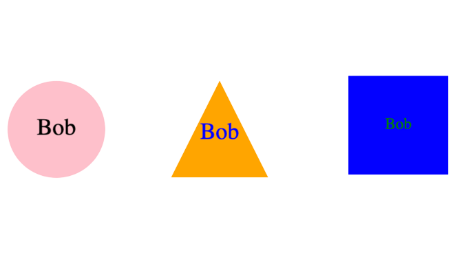

# SVG LOGO GENERATOR

## Example



## Video Demonstration

[See it working!]()

## Description

This project enables the user to create an SVG logo using only the command line. By following a series of questions, the user can create in image that contains three letters while also choosing the shape and colors. This project also incorporated Jest testing and Inquirer to help with the questions.

## Technology Used and Credit

-   [Inquirer]('https://www.npmjs.com/package/inquirer')
-   [NodeJS]('https://nodejs.org/en')
-   [FS]('https://www.w3schools.com/nodejs/nodejs_filesystem.asp')
-   [Jest]('https://jestjs.io/')

## Installations

-   NodeJS
-   Inquirer
-   Jest

## Code Example

This is a snippet of code using Jest to for testing

```describe('Circle', () => {
    describe('render', () => {
        it('should turn to desired color', () => {
            let color = 'purple';
            let circle = new Circle(color);
            let result = `<circle cx="100" cy="100" r="50" fill="${color}" />`;
            expect(circle.render()).toEqual(result);
        })
    })
})

```

## Learning Points

This was a great opportunity to have more practice using Inquirer and Node but add in testing as well. It was also interesting learning how to work with SVG images and it continues to blow my away by how much you can do using the terminal alone. It can be much more efficient to got this route with a number of applications.

## Testing Example


